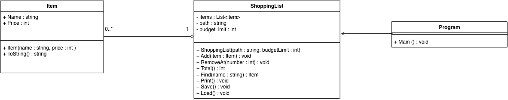

# Robust inköpslista

## Del 1 - Sex fel

### Fel 1: Programmet kraschade vid start.

**Vad hände?**
Programmet kunde krasha vid start på grund av en tom rad i filen. Sökning kunde också missa en vara som syntes i listan.

**Varför?**
`Load()` delade filen vid `\n`, men raderna i filen avslutades med `\r\n`. Då kunde `\r` bli kvar i slutet av varans namn, till exempel `"Ost\r"`. Det gjorde att sökningen inte hittade namnet `"Ost"`. Det kunde också bli en tom sista rad som gjorde att `parts[1]` inte fanns.

**Hur fixade jag det?**
Jag bytte till `File.ReadAllLines()` så att filen läses rad för rad utan att `\r` blir kvar i namnen. Jag lade också till `IsNullOrWhiteSpace()` för att hoppa över tomma rader.

### Fel 2: Filen saknades.

**Vad hände?**
Programmet kraschade om `items.txt` inte fanns.

**Varför?**
`Load()` försökte läsa filen direkt med `File.ReadAllText` utan att först kontrollera om filen fanns. Då fick programmet `FileNotFoundException`.

**Hur fixade jag det?**
Jag lade till en kontroll med `File.Exists(path)`. Om filen inte finns visar programmet ett meddelande och fortsätter utan att krasha.

### Fel 3: Bokstäver i stället för tal.

**Vad hände?**
Programmet kraschade om användaren skrev bokstäver där programmet förväntade sig ett tal.

**Varför?**
Programmet använde `int.Parse()`. Om texten inte kunde göras om till ett heltal fick programmet `FormatException`.

**Hur fixade jag det?**
Jag bytte till `int.TryParse()` så att programmet kan kontrollera inmatningen och fråga igen i stället för att krascha.

### Fel 4: Fel nummer vid borttagning.

**Vad hände?**
Programmet kraschade om användaren försökte ta bort en vara med ett nummer som inte fanns i listan.

**Varför?**
`RemoveAt()` använde `items.RemoveAt(number - 1)` utan att först kontrollera om numret var giltigt. Om numret var för stort eller mindre än 1 blev indexet fel och programmet fick `ArgumentOutOfRangeException`.

**Hur fixade jag det?**
Jag lade till en kontroll som ser till att numret är mellan 1 och antalet varor i listan innan varan tas bort. Om numret är fel visar programmet meddelandet "Det finns ingen vara med det numret." i stället för att krascha.

### Fel 5: Fel totalsumma.

**Vad hände?**
Totalsumman blev för låg. Med Mjölk (15), Bröd (32) och Ost (89) visade programmet 121 kr i stället för 136 kr.

**Varför?**
I `Total()` började loopen på `i = 1`. Då hoppade programmet över den första varan i listan.

**Hur fixade jag det?**
Jag ändrade startvärdet från `i = 1` till `i = 0` så att alla varor räknas med i summan.

### Fel 6: Fel vid sparning doldes.

**Vad hände?**
Programmet kunde säga att listan var sparad även om något gick fel vid sparningen.

**Varför?**
`Save()` hade en tom `catch`. Om `File.WriteAllText()` misslyckades fångades felet, men programmet gjorde inget med det och skrev ändå att listan var sparad.

**Hur fixade jag det?**
Jag ersatte den tomma `catch` med specifika undantag, till exempel `UnauthorizedAccessException` och `IOException`. Meddelandet "Listan är sparad." visas nu bara när sparningen lyckas.

## Klassdiagram

## Designval - Budgettak

Jag valde att skicka in budgettaket till `ShoppingList` genom konstruktorn.
I `Program.cs` skapas listan med budgeten `200`:
`new ShoppingList("items.txt", 200)`
Budgeten sparas sedan i variabeln `budgetLimit` i `ShoppingList`.
Jag valde den lösningen eftersom budgeten kan ändras i `Program.cs` utan att ändra inne i `ShoppingList`.

**Vad händer när budgeten överskrids?**
Om en ny vara gör att totalsumman går över budgettaket, kastar `Add()` ett `InvalidOperationException`. Varan läggs då inte till i listan.

**Varför ett undantag och inte false?**
Jag valde ett undantag eftersom det är fel som ska stoppas direkt. Om `Add()` bara returnerade `false` skulle det vara lättare att missa att varan inte lades till.

**Hur hanteras det i Program.cs?**
I `Program.cs` fångas `InvalidOperationException` med `catch`. Då visas meddelandet "Varan får inte plats i budgeten." och programmet fortsätter köra.
